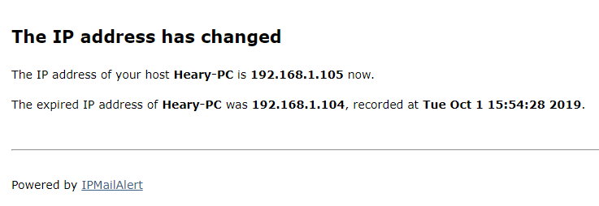

# IPMailAlert
a light-weight mail alert program via SMTP for notifying IP address changes.

## 1  Introduction

[IPMailAlert](https://github.com/HearyShen/IPMailAlert) is a light-weight mail alert program via SMTP for notifying IP address changes.

The IPMailAlert is designed to report IP address changes due to the [DHCP](https://en.wikipedia.org/wiki/Dynamic_Host_Configuration_Protocol) dynamic IP address assigning strategy. The IPMailAlert sends you an alert email via SMTP protocol to keep you informed of your current IP address.

## 2  Download

|                               | Windows                                                      | Linux                                                        |
| ----------------------------- | ------------------------------------------------------------ | ------------------------------------------------------------ |
| initial version (Oct 1, 2019) | [View Release](https://github.com/HearyShen/IPMailAlert/releases) | [View Release](https://github.com/HearyShen/IPMailAlert/releases) |

## 3  Usage

### 3.1  Download and Install

Download according to **2 Download**.

For Linux users, you can directly run this python script.

For Windows users, you can download the EXE executable.

**Python Requirement**: netifaces for retrieving IP address on Linux (use 'pip install netifaces')

### 3.2  Configurate

The `config.json` provides you the example of a configuration.

```json
{
    "smtp": {
        "host": "smtp.seu.edu.cn", 
        "port": 465,
        "username": "tom", 
        "password": "password"
    },
    "mail":{
        "sender": "tom@seu.edu.cn",
        "receivers": ["tom@example.com"] 
    }
}
```

- `"smtp"` shows the settings for SMTP.
  - `"host"`: remote (or local) host name or IP address that provides SMTP service.
  - `"port"`: listening port for SMTP service.
    - usually 465 for SMTP-via-SSL, 25 for SMTP.
    - For security concern, the current version only allows you to use SMTP-via-SSL to protect your account.
  - `"username"`: username of your account .
  - `"password"`: password of your account.
- `"mail"` shows the settings for alert mail.
  - `"sender"`: the **From** email address.
  - `"receivers"`: the **To** email addresses receiving the alert mail.

### 3.3  Run

You can run the program with the `config.json`  in the same folder, or specify the config path via `-C`/`--config`.

For Windows users, it is recommended to use Windows Task Scheduler to set a scheduled task to run this program. 

**Note: when editing the operation in Task Scheduler, set the Start-in as the directory path of the executable or script.**

You should receive an email like this when the IP address of your host changes:



## 4  License

MIT License